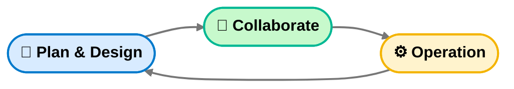

# AI 協作思考框架（AI-CoDev Framework）

## 🚀 Hello Conference 啟發

> **GITHUB COPILOT 如何重構 DEVOPS**
> - AGENTIC DEVOPS 時代降臨
> - Presented By Duran Hsieh  
> - [PTT](https://s.itho.me/ccms_slides/2025/10/29/437286bd-9911-4a23-9795-148b086f2aa4.pdf)
---

### 🧭 工作型態轉變：從 DevOps 到 AI-CoDev

#### 傳統 DevOps 流程

#### 演化為 AI-CoDev 三階段架構

⬇️ DevOps 思維的演進，精簡為三個循環階段：  
**Plan & Design → Collaborate → Operation**

這不是單純把流程合併或簡化， 
其背後的原因在於：傳統 DevOps 流程中，每一個階段仍需仰賴人工處理，  
包含需求規劃、設計、開發、測試、驗證、部署等。  

即使出現自動化技術，背後的邏輯還是「人下指令、機器執行」。  
而 AI 的加入打破了這一層邏輯，  
因為 **AI 能夠直接理解、生成、驗證並優化程式邏輯**，  
因此我們不再需要人工在每個階段手動接棒。

---

## 💡 新的思考方式

將上面的簡化後的概念進行提取，AI加入工作流程也代表一種開發思考模式的轉換：  
> 「從線性開發流程 → 變成以思考為中心的 Prompt 循環。」

開發者不只是「執行任務的人」，而是 **思考與設計的人**。  
當你能用 Prompt 跟 AI 溝通、設計、驗證想法時，
整個開發速度與思考深度都會被放大。

未來每個功能開發、Bug 修正、  甚至每個架構的設計，
都能回歸到三個階段的思維循環：
> **Plan & Design → Collaborate → Operation**

---

### 新三階段架構：Plan & Design → Collaborate → Operation

---

### Plan & Design — 思考與界定

**核心目標：**  
> 讓 AI 理解你的問題前，你必須先餵給自己足夠的上下文。

#### 目標  
釐清「我想解決什麼問題？」

#### 行動

- 明確定義輸入與輸出 
- **已知問題** 還是 **探索型問題**  **?**
- **探索型問題**：用 AI 幫你建立知識上下文（survey、分類、界定範圍）  
- **已知問題**：用 AI 幫你對齊認知並驗證盲區（Edge / Boundary Cases）

在這階段，不用急著問「怎麼做」。  
你要做的是 **建立正確的問題邊界**。

---

### Collaborate — 共同生成與修正

**核心目標：**  
> 把 AI 當「一起思考的夥伴」，不是「代替思考的工具」。

#### 思考方向
下 Prompt 時別只是「幫我寫」，而是「我們一起想想怎麼做比較好」。

#### 使用模板（Prompt Schema）
- **目標**：想達成什麼？  
- **背景**：目前系統架構或使用情境？
- **限制**：有哪些東西不能改？ 
- **輸出**：希望得到什麼？（程式碼 / 文件 / 設計圖）
- **驗收**：怎樣算成功？ 
- **例外**：有沒有潛在風險或邊界情況？
- **附件**：補上檔案或錯誤訊息 

#### 指引重點

- 把 **Prompt 作為一次「思考會議」**  
- 保留對話紀錄（變成可回溯的 Log）  
- 不斷調整 Prompt
---

### Operation — 驗證與演化

**核心目標：**  
> 驗證成果、收集回饋、再持續優化。

#### 現階段 AI 可協助的任務：

- 驗證 — 測試 AI 產出的程式或設計能不能跑
- 記錄 — 整理執行結果、Bug、效能表現
- 學習 — 分析哪種 Prompt 最有效
- 優化 — 把這些學到的東西再帶回 Plan & Design 階段

---

## 📊 框架總結

| 階段 | 核心任務 | 與 AI 的關係 | 成功指標 |
|------|-----------|---------------|-----------|
| **Plan & Design** | 定義問題與邊界 | 建立共識 | 問題定義明確、上下文完備 |
| **Collaborate** | 共創解決方案 | 協作生成 | Prompt–Response 流程穩定可重現 |
| **Operation** | 驗證與學習 | 實際迭代 | 成果可被應用與延伸 |

---
