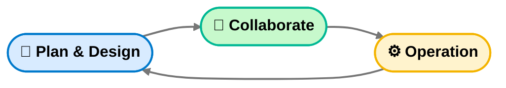

# AI 協作思考框架（AI-CoDev Framework）

## 🚀 Hello Conference 啟發

> **GITHUB COPILOT 如何重構 DEVOPS**
> - AGENTIC DEVOPS 時代降臨
> - Presented By Duran Hsieh  
> - [PTT](https://s.itho.me/ccms_slides/2025/10/29/437286bd-9911-4a23-9795-148b086f2aa4.pdf)
---

### 🧭 工作型態轉變：從 DevOps 到 AI-CoDev

## 傳統 DevOps 流程

## 演化為 AI-CoDev 三階段架構

⬇️ DevOps 思維的演進，精簡為三個循環階段：  
**Plan & Design → Collaborate → Operation**

這並非只是「統整」或「縮減流程」的表面變化。  
其背後的原因在於：傳統 DevOps 流程中，每一個階段仍需仰賴人工處理，  
包含需求規劃、設計、開發、測試、驗證、部署等。  

即使出現自動化技術，這些技術的邏輯仍然建立在人力驅動的假設上。  
AI 的加入打破了這一層邏輯，  
因為 **AI 能夠直接理解、生成、驗證並優化程式邏輯**，  
因此不再需要讓人類逐一進入每個階段的手動開發循環。

---

### 💡 新思維的出現

這代表一種思考模式的轉換：  
> 「從線性開發流程 → 演化為思考驅動的 Prompt 循環。」

開發者將不再是階段執行者，而是 **思維的設計者**。  
當開發人員能透過 Prompt 溝通、設計並即時驗證結果，  
整個開發鏈條的速度與知識密度都將被放大。  

未來每個功能的產生、每個 Bug 的修復、  
甚至每個架構的設計，都能回歸到三個階段的思維循環：
> **Plan & Design → Collaborate → Operation**

---

## 新三階段架構：Plan & Design → Collaborate → Operation

---

### Plan & Design — 思考與界定

**核心目標：**  
> 讓 AI 理解你的問題前，你必須先理解你自己。

#### 目標  
釐清「我想解決什麼問題？」

#### 行動

- 明確定義輸入與輸出（*What’s the goal?*）  
- 說出這是 **已知問題** 還是 **探索型問題**  
- **在無經驗時**：用 AI 幫你建立知識上下文（survey、分類、界定範圍）  
- **在有經驗時**：用 AI 幫你對齊認知並驗證盲區（Edge / Boundary Cases）

在這階段，不要急著要答案。  
你要做的是 **建立正確的問題空間**。

---

### Collaborate — 共同生成與修正

**核心目標：**  
> 讓 AI 成為你的 Pair Architect，而不是命令執行者。

#### 思考方向
當你下 Prompt，不是「請幫我寫」，而是「請跟我思考」。

#### 使用模板（Prompt Schema）
- **目標**：想達成什麼？  
- **背景**：現在的架構 / 使用情境？  
- **限制**：必須保留 / 不能改動 / 技術選擇？  
- **輸出**：要我生成什麼？（程式碼 / 文件 / 設計草圖）  
- **驗收**：成功的定義？  
- **例外**：邊界條件 / 潛在風險？  
- **附件**：相關檔案或錯誤訊息  

#### 指引重點

- 把 **Prompt 視為一次「思考設計會議」**  
- 每次與 AI 對話都要留痕跡（版本化思考 → *Prompt Log*）  
- 持續對 AI 的回覆進行 **Prompt Refactoring**
- 
---

### Operation — 驗證與演化

**核心目標：**  
> 將 AI 輸出的成果帶回真實世界，並建立回饋迴圈。

#### 現階段 AI 可協助的任務：

- 產生自動化測試、log 分析、報錯解釋  
- 協助快速定位問題來源與修復建議  
- 在回饋中學習「哪類 Prompt 較有效」→ 建立 *Prompt Pattern Library*

---

## 📊 框架總結

| 階段 | 核心任務 | 與 AI 的關係 | 成功指標 |
|------|-----------|---------------|-----------|
| **Plan & Design** | 定義問題與邊界 | 建立共識 | 問題定義明確、上下文完備 |
| **Collaborate** | 共創解決方案 | 協作生成 | Prompt–Response 流程穩定可重現 |
| **Operation** | 驗證並回饋 | 實作回圈 | 成果可被應用與延伸 |

---
