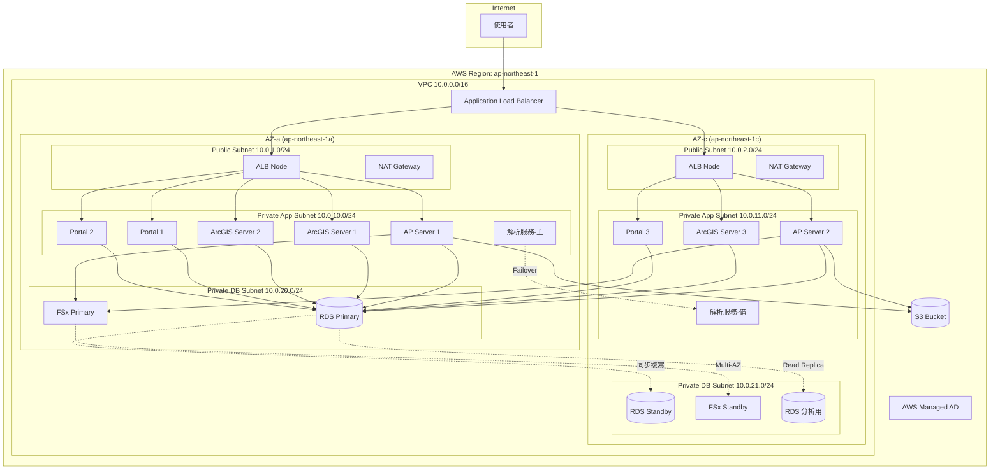
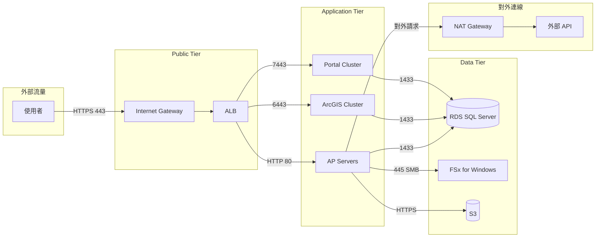
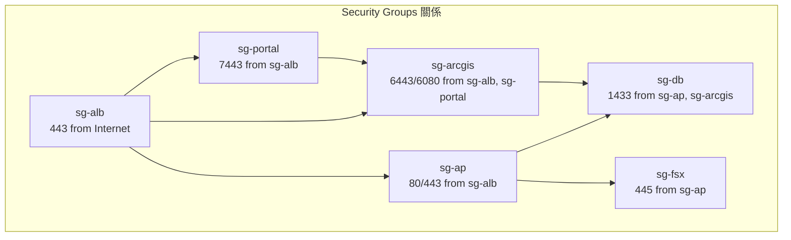

# AWS 機房遷移架構設計文件（一）：架構總覽與網路設計

> 文件版本：v1.0  
> 撰寫日期：2026-02-22  
> 適用範圍：機房至 AWS 全面遷移專案

---

## 目錄

1. [架構總覽](#1-架構總覽)
2. [網路架構設計](#2-網路架構設計)
3. [架構圖](#3-架構圖mermaid)

---

## 1. 架構總覽

### 1.1 設計目標

本次遷移採用 AWS Well-Architected Framework 為設計基準，核心目標如下：

- **高可用性**：所有關鍵服務部署於 Multi-AZ，單一 AZ 故障不影響服務運作
- **安全性**：採用私有子網部署核心服務，最小權限原則控管存取
- **可擴展性**：預留 Auto Scaling 與水平擴展能力
- **成本優化**：依據工作負載特性選擇適當的服務與執行個體類型

### 1.2 VPC 設計決策

| 設計項目 | 決策 | 理由 |
|---------|------|------|
| VPC 數量 | 單一 VPC | 所有服務屬同一業務系統，無需隔離；簡化網路管理與跨服務通訊 |
| Region | ap-northeast-1 (Tokyo) | 地理位置鄰近，延遲最低；符合資料落地要求 |
| AZ 數量 | 2 個 | 滿足高可用需求，成本與可用性平衡 |

### 1.3 Multi-AZ 架構原則

```
┌─────────────────────────────────────────────────────────────┐
│                         VPC (10.0.0.0/16)                   │
├────────────────────────────┬────────────────────────────────┤
│      AZ-a (ap-northeast-1a)│      AZ-c (ap-northeast-1c)    │
│  ┌──────────────────────┐  │  ┌──────────────────────────┐  │
│  │   Public Subnet      │  │  │   Public Subnet          │  │
│  │   (ALB, NAT GW)      │  │  │   (ALB, NAT GW)          │  │
│  └──────────────────────┘  │  └──────────────────────────┘  │
│  ┌──────────────────────┐  │  ┌──────────────────────────┐  │
│  │   Private Subnet     │  │  │   Private Subnet         │  │
│  │   (AP, ArcGIS, etc.) │  │  │   (AP, ArcGIS, etc.)     │  │
│  └──────────────────────┘  │  └──────────────────────────┘  │
│  ┌──────────────────────┐  │  ┌──────────────────────────┐  │
│  │   DB Subnet          │  │  │   DB Subnet              │  │
│  │   (RDS, FSx)         │  │  │   (RDS, FSx)             │  │
│  └──────────────────────┘  │  └──────────────────────────┘  │
└────────────────────────────┴────────────────────────────────┘
```

### 1.4 公私子網分離原則

| 子網類型 | 部署服務 | 設計理由 |
|---------|---------|---------|
| Public Subnet | ALB、NAT Gateway、Bastion Host (選用) | 僅需對外暴露的服務放置於此 |
| Private Subnet | AP Server、ArcGIS、Portal、解析服務 | 核心應用不直接暴露於網際網路 |
| DB Subnet | RDS、FSx、NAS 替代方案 | 資料層完全隔離，僅允許應用層存取 |

### 1.5 負載平衡器設計

| 元件 | 服務選擇 | 設計理由 |
|------|---------|---------|
| 外部流量入口 | Application Load Balancer (ALB) | 支援 Layer 7 路由、SSL Termination、Path-based Routing |
| ArcGIS/Portal 叢集 | ALB | 需要 HTTP/HTTPS 健康檢查、Sticky Session 支援 |
| 內部服務 | 不使用 LB，直接 DNS | 內部服務數量有限，使用 Route 53 Private Hosted Zone 即可 |

**為何選擇 ALB 而非 NLB：**
- ArcGIS Server 與 Portal 為 Web 應用，需 Layer 7 功能
- 需要根據 URL Path 路由至不同服務
- SSL Termination 集中管理，簡化憑證維護

---

## 2. 網路架構設計

### 2.1 VPC CIDR 規劃

```
VPC CIDR: 10.0.0.0/16 (65,536 個 IP)

├── Public Subnet
│   ├── 10.0.1.0/24 (AZ-a) - 256 IPs
│   └── 10.0.2.0/24 (AZ-c) - 256 IPs
│
├── Private Subnet (Application)
│   ├── 10.0.10.0/24 (AZ-a) - 256 IPs
│   └── 10.0.11.0/24 (AZ-c) - 256 IPs
│
├── Private Subnet (Database)
│   ├── 10.0.20.0/24 (AZ-a) - 256 IPs
│   └── 10.0.21.0/24 (AZ-c) - 256 IPs
│
└── 保留區段
    └── 10.0.100.0/24 ~ 10.0.255.0/24 (未來擴展用)
```

**CIDR 設計考量：**
- 使用 /16 預留充足擴展空間
- 各子網使用 /24，單一子網 251 個可用 IP（扣除 AWS 保留）
- 編號規則：1x = Public、10x = App、20x = DB，便於識別與管理

### 2.2 子網分層設計

| 子網名稱 | CIDR | AZ | 用途 | Route Table |
|---------|------|----|----|-------------|
| public-subnet-a | 10.0.1.0/24 | ap-northeast-1a | ALB, NAT GW | 指向 IGW |
| public-subnet-c | 10.0.2.0/24 | ap-northeast-1c | ALB, NAT GW | 指向 IGW |
| private-app-subnet-a | 10.0.10.0/24 | ap-northeast-1a | AP, ArcGIS, Portal | 指向 NAT GW |
| private-app-subnet-c | 10.0.11.0/24 | ap-northeast-1c | AP, ArcGIS, Portal | 指向 NAT GW |
| private-db-subnet-a | 10.0.20.0/24 | ap-northeast-1a | RDS, FSx | 無對外路由 |
| private-db-subnet-c | 10.0.21.0/24 | ap-northeast-1c | RDS, FSx | 無對外路由 |

### 2.3 NAT Gateway 設計

| 設計項目 | 決策 | 理由 |
|---------|------|------|
| NAT GW 數量 | 每個 AZ 各一個 | 單一 NAT GW 故障不影響另一 AZ 的對外連線 |
| 部署位置 | Public Subnet | NAT GW 需要 EIP 與 IGW 路由 |
| 對應關係 | 每個 Private Subnet 的 Route Table 指向同 AZ 的 NAT GW | 避免跨 AZ 流量費用 |

**為何不使用 NAT Instance：**
- NAT Gateway 為全託管服務，無需維護
- 自動 HA，單一 NAT GW 可處理高達 45 Gbps
- 雖然成本較高，但省去維運人力

### 2.4 Security Group 規劃原則

採用「最小權限原則」，依服務角色建立 SG：

| Security Group | 用途 | Inbound Rules |
|---------------|------|---------------|
| sg-alb | ALB | 443 from 0.0.0.0/0 (HTTPS) |
| sg-ap | AP Server | 80/443 from sg-alb |
| sg-arcgis | ArcGIS Server | 6443/6080 from sg-alb, sg-portal |
| sg-portal | Portal | 7443 from sg-alb |
| sg-db | RDS SQL Server | 1433 from sg-ap, sg-arcgis |
| sg-fsx | FSx | 445/5985 from sg-ap, sg-arcgis |
| sg-ad | AD Domain Controller | 依 AD 需求開放，限定 VPC CIDR |

**設計原則：**
- 以 Security Group ID 作為來源，而非 IP CIDR
- 拒絕開放 0.0.0.0/0 至後端服務
- 所有 SG 的 Outbound 預設為全開（依需求可收緊）

### 2.5 NACL 規劃原則

NACL 作為第二層防護，採用粗粒度控制：

| NACL | 適用子網 | 規則策略 |
|------|---------|---------|
| nacl-public | public-subnet-* | 允許 443 入站、Ephemeral Port 回應 |
| nacl-private-app | private-app-subnet-* | 僅允許來自 VPC CIDR 的流量 |
| nacl-private-db | private-db-subnet-* | 僅允許來自 10.0.10.0/23 (App Subnet) |

**NACL vs Security Group 職責分工：**
- NACL：子網層級的粗略過濾，阻擋明顯異常流量
- Security Group：執行個體層級的細緻控管，依服務需求設定

---

## 3. 架構圖（Mermaid）

### 3.1 完整架構圖



### 3.2 網路流量路徑圖



### 3.3 Security Group 關係圖



---

## 附錄：設計決策摘要

| 決策項目 | 選擇 | 替代方案 | 選擇理由 |
|---------|------|---------|---------|
| Region | Tokyo (ap-northeast-1) | Osaka (ap-northeast-3) | Tokyo 服務較完整，AZ 數量多 |
| AZ 數量 | 2 | 3 | 成本考量，2 AZ 已滿足 HA 需求 |
| NAT Gateway | 每 AZ 一個 | 共用一個 | 避免單點故障，跨 AZ 費用 |
| Load Balancer | ALB | NLB | Layer 7 功能、Path Routing |
| 子網切分 | /24 per subnet | /25 或更小 | 預留空間，便於管理 |

---

> 下一份文件：[AWS 機房遷移架構設計文件（二）：各服務角色設計](./AWS-Migration-Services-Design.md)

