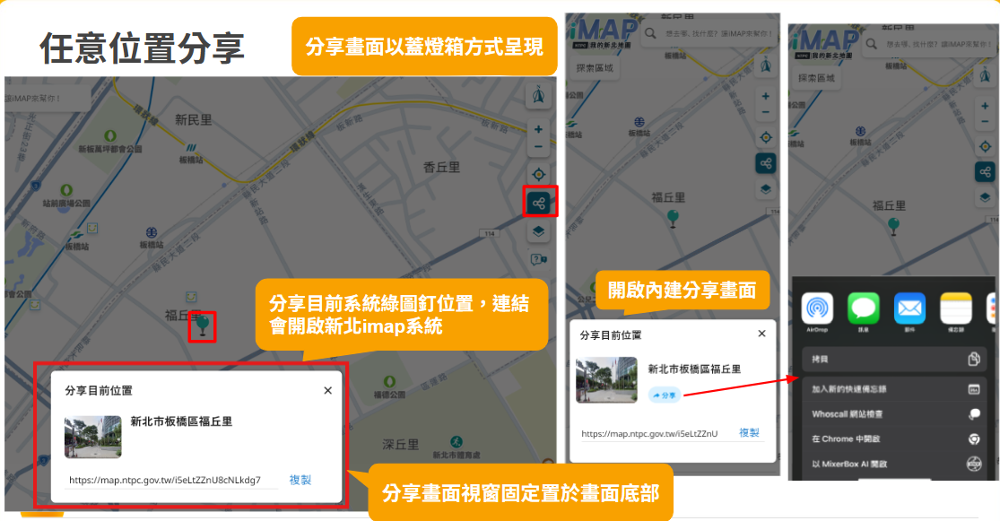

# iMap 定位分享功能－簡易需求描述

## 需求背景
目前使用者在 iMap 上看到某個位置時，若要分享給他人，只能透過截圖或自行描述位置，容易產生誤差，也增加溝通成本。

希望提供一個簡單的分享方式，讓使用者可以直接分享地圖上的位置。

---

## 需求說明
使用者在 iMap 地圖上瀏覽時，可將目前地圖所顯示的位置產生一個分享連結。  
接收者點擊該連結後，瀏覽器會開啟 iMap，並顯示與分享者相同的位置。

---

## 使用情境
- 使用者在地圖上移動到某個集合地點
- 將該位置的連結分享給親友
- 親友點擊連結後，可直接看到對方所分享的位置

---

## 預期效果
- 分享流程簡單直覺
- 接收者不需要額外搜尋或操作
- 可作為導入 iMap 平台的入口

---

## 補充說明
- 相關概念與初步示意，可參考以下圖片：  
  
