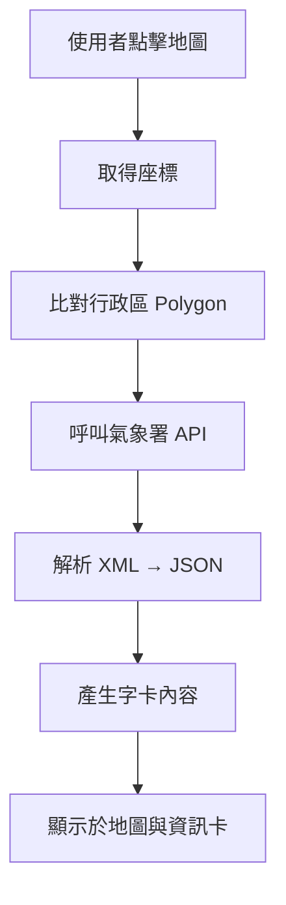

# 🧩 新北 iMAP-即時資訊 系統需求與設計文件

---

## 📘 1. 文件基本資訊

| 項目 | 內容 |
|------|------|
| 文件名稱 | 新北 iMAP 系統功能模組需求與設計說明 |
| 文件版本 | v1.0.0 |
| 更新日期 | 2025/10/17 |
| 編寫者 | 開發組（SA 負責人: XXX） |
| 資料來源 | CPJ25007_新北系統維運案_需求管控表、需求訪談紀錄 |
| 適用系統 | 新北 iMAP |
| 關鍵標籤 | #地圖呈現 #圖文連動 #鄰近資訊 #查詢邏輯 #介接資料來源 |

---

## 🧭 2. 功能概要

### 2.1 系統目的

本系統提供新北市地圖式資訊查詢平台，整合多項即時與靜態資料（天氣、停車、YouBike、學區、公告地價等），  
以「地圖 + 資料卡」的方式呈現，提升使用者在地資訊查詢體驗。

### 2.2 功能清單（模組化）

| 功能編號 | 功能名稱 | 結果面板版型 | 查詢邏輯 | 狀態 |
|-----------|-----------|-------|------------|--------|
| F01 | 天氣資訊 | A | 點位查詢（Point-in-Polygon） | ✅ 完成 |
| F02 | 所屬學區 | A | 點位查詢（PIP） | 🟡 進行中 |
| F03 | 公告現值 | A | 點位查詢（PIP） | ✅ 完成 |
| F04 | 都市計畫範圍 | A | 交集判斷（Intersect） | 🟡 進行中 |
| F05 | 轄區警局 | A | 門牌對應（Address-to-District） | 🟡 進行中 |
| F06 | YouBike | B | 環域查詢（Buffer 1KM） | ✅ 完成 |
| F07 | 停車資訊 | B | 環域查詢（Buffer 1KM） | 🟡 進行中 |
| F08 | 活動地圖 | B | 環域查詢（Buffer 1KM） | 🟡 進行中 |
| F09 | Wifi 熱點 | C | 點位查詢 | 🟢 已規劃 |
| F10 | AED 資訊 | C | 點位查詢 | 🟢 已規劃 |

---

## ⚙️ 3. 系統行為與操作邏輯

### 3.1 操作通則（共用互動邏輯）

| 事件 | 條件 | 行為 | 結果 |
|------|------|------|------|
| 點擊功能按鈕 | 功能未開啟 | 開啟該功能模組、查詢資料、顯示圖卡 | 顯示結果於地圖與圖卡 |
| 點擊功能按鈕（第二次） | 功能已開啟 | 收合圖卡、清除地圖圖徵 | 回復初始狀態 |
| 點擊 X（關閉鍵） | 任意狀態 | 關閉功能模組並清除資料 | 所有圖徵與圖卡消失 |
| 點擊地圖圖徵 | 資料存在 | 顯示詳細資訊 | 開啟字卡內容 |
| 資料逾時或異常 | 任意 | 顯示錯誤提示 icon | 禁止操作 |

### 3.2 版型差異說明

| 版型 | 適用功能 | 顯示方式 | 特殊互動邏輯 |
|------|------------|------------|----------------|
| A | 天氣資訊、學區、公告現值、都市計畫、轄區警局 | 單一字卡顯示於畫面上方 | 第二次點擊會清除圖層與字卡 |
| B | YouBike、停車、活動地圖 | 提供查詢清單與距離排序 | 第二次點擊僅收合清單，保留圖層 |
| C | Wifi 熱點、AED | 僅顯示點位圖徵與字卡 | 沒有列表搜尋功能 |

---

## 🌦️ 4. 功能詳細規格（以 F01 天氣資訊為例）

### 4.1 功能說明

使用者於地圖上點擊任一點位後，系統依該點位所在行政區查詢天氣資料，  
顯示「溫度、天氣、降雨機率、紫外線、空氣品質」資訊於圖卡上。

---

### 4.2 操作流程（互動邏輯）

| 步驟 | 操作 | 系統行為 |
|------|------|-----------|
| 1 | 使用者點擊地圖位置 | 取得經緯度座標 |
| 2 | 系統判斷該點所在行政區（TownCode） | 執行 `pointInPolygon()` |
| 3 | 系統呼叫氣象署 API | 查詢對應行政區當前天氣資訊 |
| 4 | 回傳資料後顯示字卡 | 顯示溫度、天氣、降雨機率、紫外線、空氣品質 |
| 5 | 若使用者再次點擊天氣圖示 | 清除圖徵與字卡 |

---

### 4.3 查詢邏輯與資料流

---

### 4.4 資料來源與介接規格

| 資料類型 | 來源 | 格式 | 更新頻率 | API 金鑰 | 備註 |
|-----------|-------|--------|------------|-----------|------|
| 天氣預報 | 中央氣象署 F-D0047-069 | XML | 每小時 | `CWA-3361A1E5-XXXX` | 一般會員每日上限 20,000 次 |
| 紫外線 | 中央氣象署 O-A0003-001 | XML | 每小時 | 同上 | 改版後使用該資料集 |
| 空氣品質 | 環境部 AQX_P_432 | XML | 每小時 | `3059692c-d5eb-XXXX` | 支援北北基宜桃多縣查詢 |

---

### 4.5 畫面呈現（UI 綁定）

| 區域 | 元件 | 綁定資料 | 備註 |
|------|------|-----------|------|
| 左側功能列 | 功能按鈕：天氣資訊 | 無 | 控制開啟 / 關閉功能模組 |
| 地圖主區 | 圖徵圖層：天氣點位 | 座標 / Weather Icon | 根據 `weatherCode` 對應 icon |
| 上方字卡 | 溫度、天氣、降雨機率、紫外線、空氣品質 | 綁定 API 回傳結果 | 資料更新時即重查並刷新顯示 |

---

### 4.6 錯誤與例外處理

| 狀況 | 系統行為 | UI 呈現 |
|------|------------|----------|
| API 回傳空資料 | 顯示「暫無資料」灰階字卡 | 禁止互動 |
| API 逾時 / 金鑰錯誤 | 顯示錯誤提示 icon | 提示使用者重試 |
| 網路中斷 | 保留上次成功結果 | 不重新查詢 |
| 無行政區對應 | 顯示「查無資料」訊息 | 不觸發查詢 |

---

### 4.7 驗收條件（Test Case）

| 測試項目 | 測試步驟 | 預期結果 |
|------------|------------|------------|
| 正常查詢 | 點選任意地點 | 顯示當前天氣、溫度、降雨機率等資訊 |
| 無資料情境 | 點選無行政區資料區域 | 顯示「暫無資料」 |
| API 錯誤 | 模擬金鑰錯誤 | 顯示「系統逾時」提示 |
| 再次點擊 | 點擊已開啟之功能 | 收合字卡並清除圖徵 |

---

## 🧮 5. 其他功能模組摘要

### F02. 所屬學區

- **資料來源**：教育局資料庫 `IMC_SDE_02.dbo.TC_SchoolBlock`
- **查詢邏輯**：依圖釘所在「村里鄰」查詢對應學校
- **顯示方式**：國小 / 國中各一張字卡，若多學區則堆疊顯示
- **地圖圖徵**：學校位置 POI，查詢半徑 1 公里

---

### F03. 公告現值

- **資料來源**：新北地政局 `Land/MapServer`
- **查詢邏輯**：比對圖釘所在地籍區塊，顯示公告現值與地價
- **欄位對應**：
  - `AA16` → 公告現值
  - `AA17` → 公告地價

---

### F04. 都市計畫範圍

- **資料來源**：ArcGIS Server `IMAP/UrbanBoundry/`
- **判斷方式**：判斷點與 Polygon 是否相交
- **例外處理**：若無資料，顯示「非都市計畫區」

---

### F05. 轄區警局

- **資料來源**：
  - `IMC_SDE_02.dbo.TC_Police_area`
  - `IMC_SDE_02.dbo.TC_Police_UNIT`
- **查詢邏輯**：依村里代碼對應所屬派出所
- **地圖顯示**：警局 POI + 名稱字卡

---

### F06–F08. 鄰近查詢功能（YouBike / 停車 / 活動地圖）

- **查詢方式**：以圖釘座標建立 1 公里 buffer
- **清單顯示**：依距離排序
- **輔助功能**：提供搜尋、撥打電話、導航按鈕
- **版型**：B 類（可展開清單、保留地圖圖層）

---

### F09. Wifi 熱點

- **資料來源**：`IMC_SDE_02.sde.LM_SERVICES_NTPC`
- **顯示方式**：POI 點位 + SSID 名稱字卡
- **補充說明**：僅地圖顯示，無搜尋清單

---

### F10. AED 急救站

- **資料來源**：衛生局醫事管理科 `IMC_SDE_02.sde.LM_HOSPITAL_NTPC`
- **顯示方式**：POI 點位 + 地址字卡
- **補充說明**：後續計畫與醫療地圖整合顯示

---

## 🧱 6. 系統非功能需求

| 類別 | 需求內容 |
|------|------------|
| 效能 | 查詢回應時間 ≤ 3 秒 |
| 可用性 | 系統全年可用率 ≥ 95% |
| 安全性 | 所有 API 金鑰置於伺服端，不於前端暴露 |
| 維運性 | 模組化程式架構，易於新增功能模組 |
| 相依性 | ArcGIS Server、CWA API、MOENV API 可用性 |
| 延展性 | 預留未來增加其他即時圖層（交通、災害等） |
| 國際化 | 採 UTF-8 編碼，地名多語系支援 |
| 紀錄與稽核 | 系統需記錄查詢日誌與 API 呼叫次數 |

---

## 🧾 7. 附錄

### 7.1 資料對照表（主要欄位）

| 功能 | 資料表 | 欄位名稱 | Alias | 型別 |
|--------|----------|------------|--------|--------|
| 公告現值 | Land | AA16 | 公告現值 | Integer |
| 公告地價 | Land | AA17 | 公告地價 | Integer |
| 學區資料 | TC_SchoolBlock | SchoolName | 學校名稱 | String |
| 警局轄區 | TC_Police_UNIT | Alias | 機關名稱 | String |

